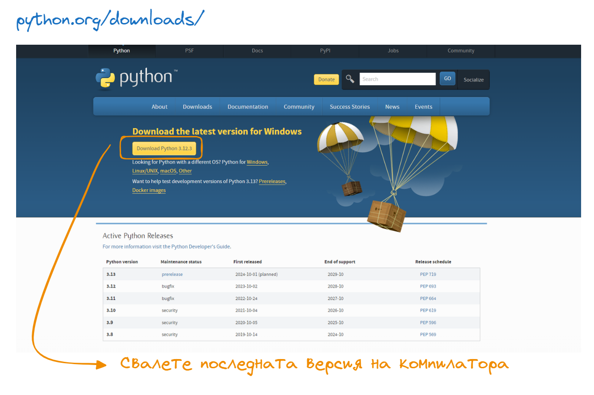
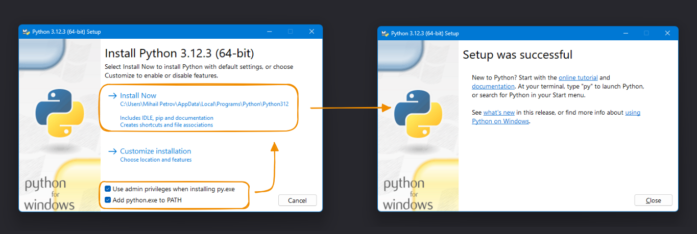
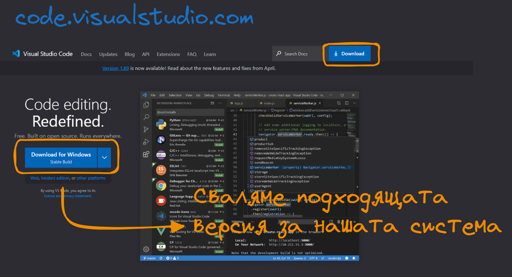
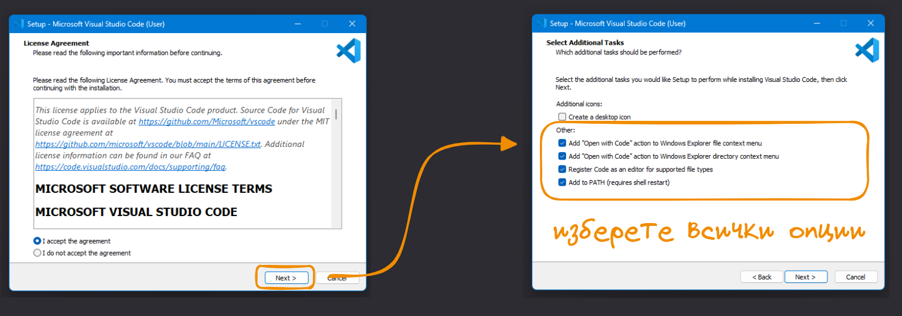
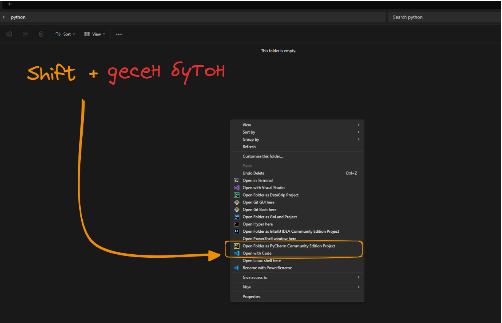
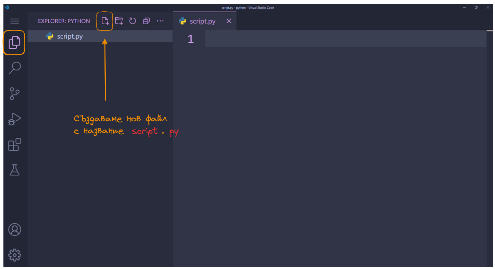
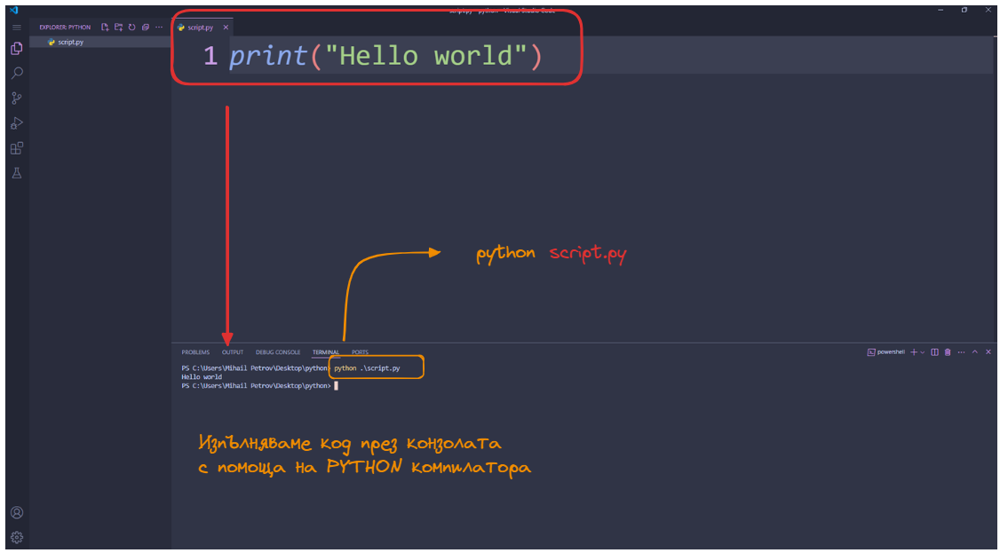
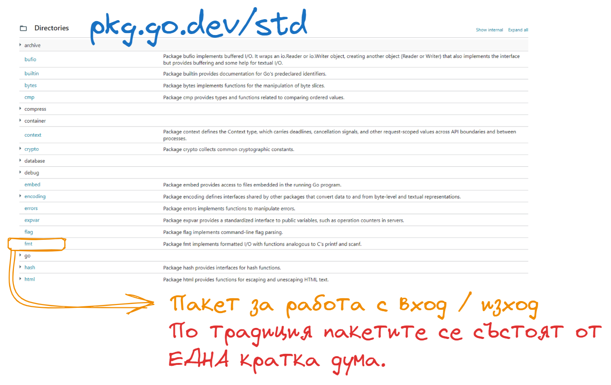
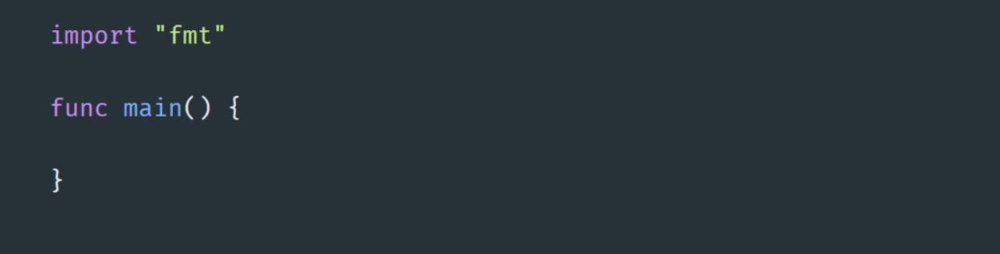
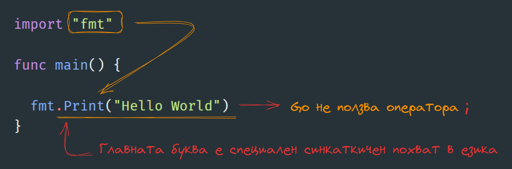

# Среща 1 - Основни характеристики на Golang

#### 💡 Какво разгледахме днес
- Какво е език за програмиране и как ни помага ?
- Какво е компилатор и защо трябва да се съобразяваме с него ?
- Среда за разработка;
- Първия ни Hello World проект - в различните среди

#### 🕹️ Ресурси и материали
- [Компилатор за Python](https://www.python.org/downloads/)
- [VSCode среда за разработка](https://code.visualstudio.com/)
- [PyCharm среда за разработка](https://www.jetbrains.com/pycharm/download/)

За целите на този курс имаме два възможни варианта за инсталация на Golang като среда за разработка:
- Архивирана версия - особено в случаи, в които нямаме права за инсталация на exe-то.
- Версия за инсталация - препоръчвам във всички случай, защото спестява много безмислено търсене на команди

Така че смело посетета офицялния адрес съдържащ последната версия на компилатора на Golang и дръпнете правилната разфасовка за вашия сценарии.

## Какво е език за програмиране и как ни помага ?

## Какво е компилатор и защо трябва да се съобразяваме с него ?

 
## Инсталация на Python компилатора
 

## Среда за разработка

Към момента на пазара има две доста популярни решения, за разработка на Python проекти:
- [Pycharm на JetBrains](https://www.jetbrains.com/go/) - напълно оборудвано IDE от JetBrains. Продукта улеснява неимоверно работата с Python базирани проекти, поради факта че съдържа в себе си цялостния workflow и инструменти за управление на качеството на кода.
- [VsCode](https://code.visualstudio.com/) с плъгин за [Python](https://marketplace.visualstudio.com/items?itemName=ms-python.python)- VSCode няма нужда от представяне. Плъгина за Pycharm предоставя базови синтактични правила и дописване на код. На моменти не реагира достатъчно адекватно, но за целите на нашето обучение ще свърши напълно адекватна работа.

### Как да си направим нов проект в VS Code

След като инсталираме нашия Python компилатор можем да създадем задължителния ни Hello World проект. За тази цел ще си създадем една нова директория, в която ще разпишем нашия код. Ако не сте го направили сега е момента да се запознаете с нашия стартов проект, с които ще разгледаме основите на езика. 

<!-- 

Като за начало ще започнем с най-елементарния код, за който можем да се сетим. Go е основно процедурен език за програмиране и както повечето такива задължително трябва да инициализираме **main функция** , от която стартира нашето приложение.

Няколко особености:
- имаме само една единствена функция main - в рамките на нашия проект.
- всички функции се записват с ключовата дума **func**

### Да визуализираме малко текст

За да работим с входно изходни потоци от данни е необходимо да използваме **ПАКЕТ от функционалности**, част от **стандартната библиотека** на езика. За референция и бъдещи справки, можете да посетите [този линк](https://pkg.go.dev/std) и да видите всички вградени функционалности в Go.

Името на пакета е малко странно и то е **fmt** - което е съкращение от формат. Някой от имената на пакетите, са меко казано странни, но бързо се свиква. 
За да добавим пакет към файла ползваме командата **import** и името на пакета. 

За да визуализираме какъвто и да е текст, числа и прочие данни ползваме функцията **Print** която е част от пакета. 

Две важно особености:
- Go е доста ориентиран към конвенциите - тоест ако пишете кода по определен начин, се случват специфични неща без да е необходимо да ползвате специални или ключови думи. В този случай главните букви в имената на функциите не са за красота а те имат доста специфично влияние върху кода.
- Go се стреми да опростява част от операциите. Поради тази причина класическата точка и запетая е премахната, като оператор за край на даден израз. -->