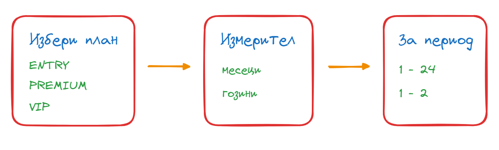

🟦 **домашна работа**
# Абонаментни планове - защитени

## 🟥 Въведение
Репутацията на нашата любима кабеларка, е пострадала от дефектен софтуер, в които потребителите - укрелини от възможността за работа с компютър, решили да си щракат каквото им хрумне. Време е да променим софтуера и модела, по който ще работим.

## 🟦 Спецификация

Потребителя въвежда в системата абонаментен пакет, който иска да закупи. Пакетите са именовани както следва:
- ENTRY
- PREMIUM
- VIP

Потребителя, трябва да избере за какъв период от време ще се абонира:
- месеци
- години

Потребитела, въвежда времето на своя абонамен:
- ако сме избрали месеци - позволената стойност е от 1 до 24
- ако сме избрали години - позволените стойности са 1 и 2

Ако потребителя избере дву-годишен период - (без значение далипотребителя е избрал срока в месеци или години) - то той има право да получи подарък:
- телефон
- телевизор

Системата извежда информация за направения избор - в следния вид:
Вие избрахте **{ИМЕ НА ПАКЕТА}**, за период от **{N}** **{месеци / години }** имате подарък. 

Съобщението трябва да е съобразено, с избора на потребителя.

Във всеки един момент потребителя, може да въведе грешна стойност - и системата трябва да му дава съобщение за грешка и възможност да въведе правилната стойност отново.
Във всеки един момент потребителя, трябва да може да се върне към предишното меню, като избере специална опция **Назад**. 

