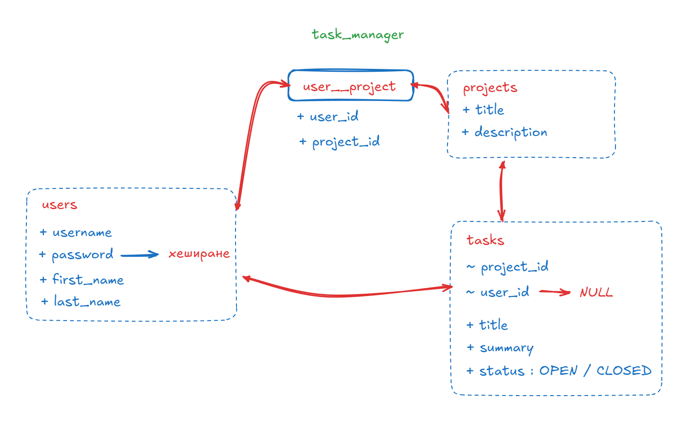

## Система за управление на задачи

В рамките на този курсов проект ще разработим система за управление на задачи, която ще включва следните информационни единици:
- потребители
- проекти
- задачи

Проектната структура на базата данни, която измислихме до момента е показана на картинката:

